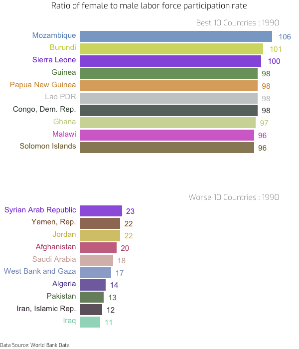

Plotting exercises with R
================
2023-02-01

<style type="text/css">
  body{
  font-family: Exo;
}
</style>

Practice of different types of data visualization

------------------------------------------------------------------------

## Bar race animation charts

Following code from
<https://www.r-bloggers.com/2020/01/how-to-create-bar-race-animation-charts-in-r/>.

For this example it will be used a data set from the world data bank for
the [ratio of female to male labor force participation
rate](https://databank.worldbank.org/source/gender-statistics/Type/TABLE/preview/on#).
The data is in the datasets folder.

### Clean the data

``` r
dt <- read_csv(here('datasets/RatioGenderLaborForce.csv'),show_col_types = FALSE, na = "..") %>%
  select(-"Series Name", -"Series Code" ) %>%
  drop_na() %>%
  mutate_at(vars(contains("YR")),as.numeric) %>%
  pivot_longer(cols = -c("Country Name","Country Code"), names_to = "year") %>%
  janitor::clean_names() %>%
  mutate(year = as.numeric(stringr::str_sub(year,1,4))) 
```

### Format the data in order to keep only the top 10 worse countries for every given year

``` r
dt_formatted <- dt %>%
  group_by(year) %>% 
  mutate(rank = rank(-value),
         value = round(value,0)) %>%
  group_by(country_name) 

dt_formattedTop <- dt_formatted %>%
  filter(rank <= 10) %>%
  ungroup()

dt_formattedbottom <- dt_formatted %>%
  filter(rank > max(unique(dt_formatted$rank) - 10)) %>%
  ungroup()
```

### Build static plot

``` r
staticplot1 = ggplot(dt_formattedTop, aes(rank, group = country_name,
                fill = as.factor(country_name), color = as.factor(country_name))) +
  geom_tile(aes(y = value/2,
                height = value,
                width = 0.9), alpha = 0.8, color = NA) +
  geom_text(aes(y = 0, label = paste(country_name, " ")), vjust = 0.2, hjust = 1) +
  geom_text(aes(y=value, label = value, hjust=-0.5)) +
  coord_flip(clip = "off", expand = FALSE) +
  ylim(0,110) +
  scale_x_reverse() +
  scale_fill_iwanthue() +
  scale_color_iwanthue() +
  guides(color = "none", fill = "none") +
theme(axis.line=element_blank(),
      axis.text=element_blank(),
      axis.ticks=element_blank(),
      axis.title=element_blank(),
      legend.position="none",
      panel.background=element_blank(),
      panel.border=element_blank(),
      panel.grid=element_blank(),
      # panel.grid.major.x = element_line( size=.1, color="grey" ),
      # panel.grid.minor.x = element_line( size=.1, color="grey" ),
      plot.subtitle=element_text(hjust=1),
      plot.background=element_blank(), plot.margin = margin(1,1, 1, 4, "cm"),
      text=element_text(family="Exo")) +  
  transition_states(year, transition_length = 2, state_length = 1,
                    wrap = FALSE) +
  view_follow(fixed_x = TRUE, fixed_y = TRUE)  +
  labs(subtitle = "Best 10 Countries : {closest_state}") +
  enter_fade() + 
  exit_shrink() +
  ease_aes('sine-in-out')

staticplot2 = ggplot(dt_formattedbottom, aes(rank, group = country_name,
                fill = as.factor(country_name), color = as.factor(country_name))) +
  geom_tile(aes(y = value/2,
                height = value,
                width = 0.9), alpha = 0.8, color = NA) +
  geom_text(aes(y = 0, label = paste(country_name, " ")), vjust = 0.2, hjust = 1) +
  geom_text(aes(y=value, label = value, hjust=-0.5)) +
  coord_flip(clip = "off", expand = FALSE) +
    ylim(0,110) +
  scale_x_reverse() +
  scale_fill_iwanthue() +
  scale_color_iwanthue() +
  guides(color = "none", fill = "none") +
theme(axis.line=element_blank(),
      axis.text=element_blank(),
      axis.ticks=element_blank(),
      axis.title=element_blank(),
      legend.position="none",
      panel.background=element_blank(),
      panel.border=element_blank(),
      panel.grid=element_blank(),
      # panel.grid.major.x = element_line( size=.1, color="grey" ),
      # panel.grid.minor.x = element_line( size=.1, color="grey" ),
      plot.subtitle=element_text(hjust=1),
      plot.background=element_blank(), plot.margin = margin(1,1, 1, 4, "cm"),
      text=element_text(family="Exo")) +  
  transition_states(year, transition_length = 2, state_length = 1,
                    wrap = FALSE) +
  view_follow(fixed_x = TRUE, fixed_y = TRUE)  +
  labs(subtitle = "Worse 10 Countries : {closest_state}") +
  enter_fade() + 
  exit_shrink() +
  ease_aes('sine-in-out')
```

### Make and render animation with two plots

``` r
#Ratio of female to male labor force participation rate
#caption  = "% | Data Source: World Bank Data"

frames=200
gif1 <- animate(staticplot1, frames, width = 600, height = 350, res = 100,
        renderer = gifski_renderer("gganim1.gif"), end_pause = 10, rewind = TRUE)
gif2 <- animate(staticplot2, frames,width = 600, height = 350, res = 100,
        renderer = gifski_renderer("gganim2.gif"), end_pause = 10, rewind = TRUE)

a_mgif <- image_read(gif1)
b_mgif <- image_read(gif2)
if(length(a_mgif) == length(b_mgif)){
  new_gif <- image_append(c(a_mgif[1], b_mgif[1]), stack =TRUE)
  for(i in 2:length(a_mgif)){
    combined <- image_append(c(a_mgif[i], b_mgif[i]), stack =TRUE)
    new_gif <- c(new_gif, combined)
  }
}
new_gif %>%
  image_annotate("Ratio of female to male labor force participation rate", 
                 size = 16, font = "Exo", gravity = "north") %>%
  image_annotate("Data Source: World Bank Data", 
                 size = 10, font = "Exo", gravity = "southwest")
```


